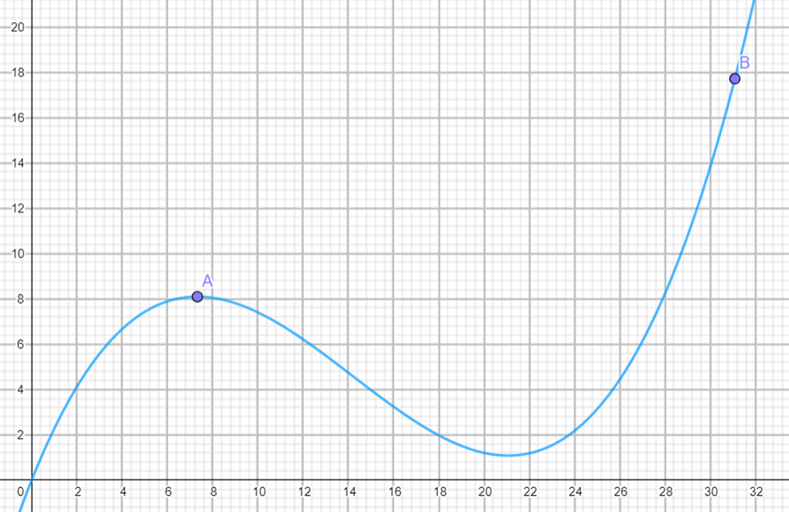

# Genetischer-Algorithmus

Genetischer Algorithmus zum Finden des x-Werts des globalen Maximums der Funktion f(x) = 0,0054 x^3 - 0,23 x^2 + 2,5 x im Intervall [0,31]. Diese Funktion hat ein lokales (Punkt A) und ein globales (Punkt B) Optimum. 

## Dependencies

numpy und matplotlib

